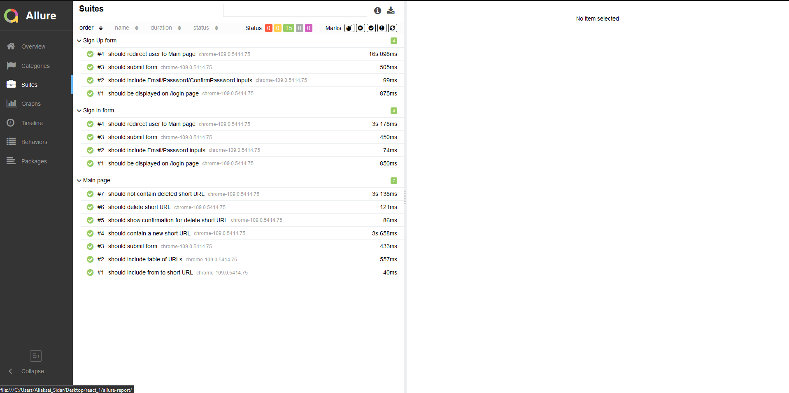

# _[TBC]_

---

## "URL Shortener" learning project (e2e automation)

_by Sidar Aliaksei_

**_[Back-end part (Node.js)](https://github.com/aliakseisidar/URLShortener_server)_**

---

### To srart app:

```
npm start
```

### To start tests:

1. `npm run test:all`
2. `npm run test:singUp`
3. `npm run test:happyPath`
4. `npm run test:suite1`

---

### Library used:

- WebDriverIO + mocha
- Allure Reporter
- etc.

---

#### Scenarios:

<details>
  <summary>Sign Up (positive)</summary>

### Before:

1. no

### Steps:

1. Open Login page.
2. Fill Sign Uo form.
3. Click Sing Up.

### After:

1. Delete a user.

## </details>

<details>
  <summary>User flow (Happy Path)</summary>
  
### Before:

1. no

### Steps:

1. Open LogIn page.
2. Fill LogIn form.
3. Click LogIn.
4. Short any valid URL.
5. Delete the URL.

### After:

1. Delete a URL.
</details>

---

### Allure report sample


