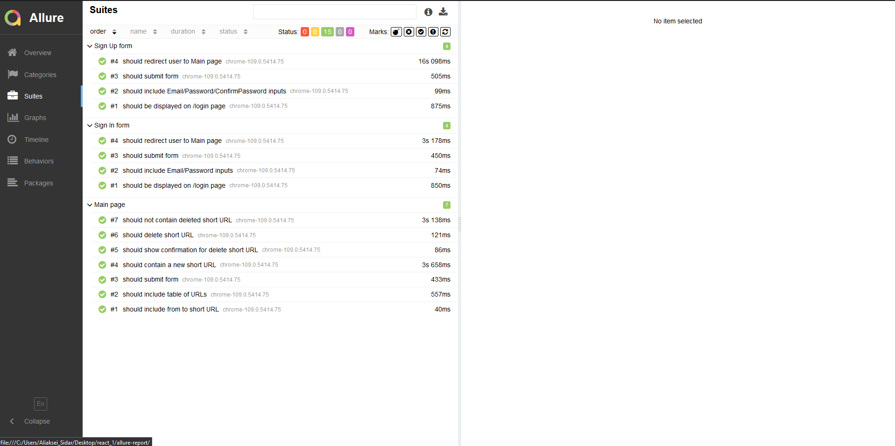

# _[TBC]_

---

## "URL Shortener" learning project (e2e automation)

_by Sidar Aliaksei_

**_[e2e Autotests (WebDriverIO)](https://github.com/aliakseisidar/URLShortener_client/tree/autotests_e2e)_**

**_[Back-end part (Node.js)](https://github.com/aliakseisidar/URLShortener_server)_**

---

#### Library used:

- React Router Dom v.6
- React Hook Form
- React Infinite Scroll Component
- Material UI
- Axios
- etc.

---

#### Scenarios:

  
Sign Up (positive)

### Before:

1. no

### Steps:

1. Open Login page.
2. Fill Sign Uo form.
3. Click Sing Up.

### After:

1. Delete a user.

## 

  
User flow (Happy Path)

  
### Before:

1. no

### Steps:

1. Open LogIn page.
2. Fill LogIn form.
3. Click LogIn.
4. Short any valid URL.
5. Delete the URL.

### After:

1. Delete a URL.

---

### Allure report sample

